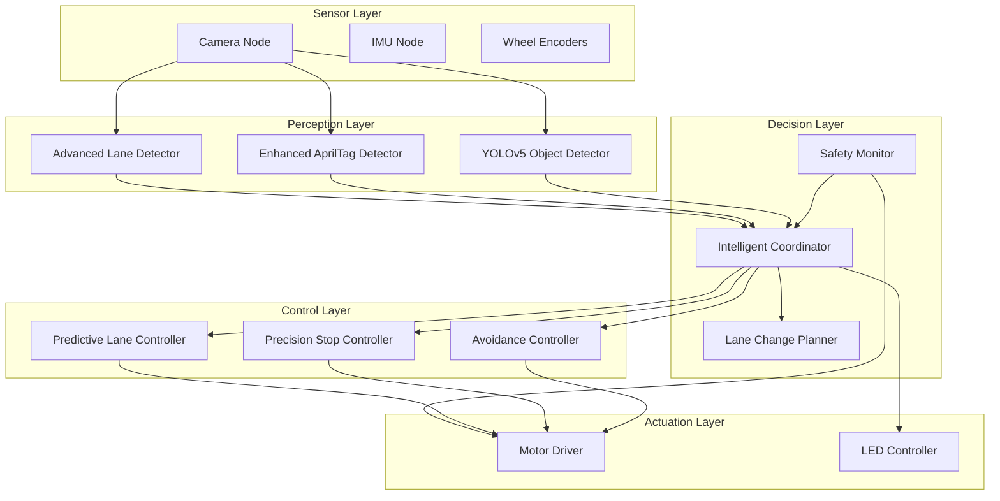

# Design Document

## Overview

The Advanced Autonomous Duckietown System is designed as a modular enhancement to the existing dt-core, implementing sophisticated autonomous navigation capabilities through a multi-layered architecture. The system integrates advanced computer vision, deep learning-based object detection, predictive control algorithms, and comprehensive safety monitoring to achieve robust autonomous operation in Duckietown environments.

The design follows a distributed ROS-based architecture where specialized nodes handle specific aspects of perception, decision-making, and control, coordinated through a central intelligent coordinator that manages behavior arbitration and safety oversight.

## Architecture

### System Architecture Overview



### Data Flow Architecture

The system implements a hierarchical data flow with multiple processing pipelines:

1. **Perception Pipeline**: Raw sensor data → Feature extraction → Object/lane detection
2. **Decision Pipeline**: Perception results → Risk assessment → Behavior selection
3. **Control Pipeline**: Behavior commands → Trajectory planning → Motor commands
4. **Safety Pipeline**: System monitoring → Fault detection → Emergency response

## Components and Interfaces

### 1. Advanced Lane Detection Module

**Package**: `packages/advanced_lane_detection/`

**Core Components**:
- `AdaptiveThresholdDetector`: Dynamic threshold adjustment based on lighting conditions
- `TemporalConsistencyFilter`: Multi-frame consistency checking for stable detection
- `PolynomialCurveFitter`: Advanced curve fitting for trajectory prediction
- `ROIManager`: Dynamic region of interest adjustment based on vehicle state

**Key Interfaces**:
```python
class AdvancedLaneDetector:
    def detect_lanes(self, image: np.ndarray, vehicle_state: VehicleState) -> LaneDetectionResult
    def update_parameters(self, lighting_conditions: LightingConditions) -> None
    def get_detection_confidence(self) -> float
```

**ROS Interface**:
- **Subscribes**: `/camera/image_raw` (sensor_msgs/Image)
- **Publishes**: `/advanced_lane_detector/lane_curves` (custom LaneCurves message)
- **Services**: `/advanced_lane_detector/reconfigure` (dynamic parameter adjustment)

### 2. Enhanced AprilTag Detection Module

**Package**: `packages/enhanced_apriltag/`

**Core Components**:
- `MultiResolutionDetector`: Multi-scale detection for improved robustness
- `DistanceEstimator`: Precise distance calculation using tag geometry
- `FalsePositiveFilter`: Confidence-based filtering of spurious detections
- `ApproachAngleCalculator`: Orientation analysis for optimal stopping

**Key Interfaces**:
```python
class EnhancedAprilTagDetector:
    def detect_tags(self, image: np.ndarray) -> List[AprilTagDetection]
    def estimate_distance(self, detection: AprilTagDetection) -> float
    def calculate_approach_vector(self, detection: AprilTagDetection) -> Vector3D
```

**ROS Interface**:
- **Subscribes**: `/camera/image_raw` (sensor_msgs/Image)
- **Publishes**: `/enhanced_apriltag/detections` (custom AprilTagDetectionArray)
- **Services**: `/enhanced_apriltag/set_target_distance` (stop distance configuration)

### 3. YOLOv5 Object Detection Module

**Package**: `packages/yolo_object_detection/`

**Core Components**:
- `OptimizedYOLODetector`: TensorRT-optimized inference engine
- `DuckietownClassifier`: Custom-trained model for Duckietown objects
- `RiskAssessment`: Collision risk evaluation based on object properties
- `PerformanceMonitor`: Real-time performance tracking and optimization

**Key Interfaces**:
```python
class YOLOObjectDetector:
    def detect_objects(self, image: np.ndarray) -> List[ObjectDetection]
    def assess_collision_risk(self, detections: List[ObjectDetection], vehicle_state: VehicleState) -> RiskLevel
    def get_inference_metrics(self) -> PerformanceMetrics
```

**ROS Interface**:
- **Subscribes**: `/camera/image_raw` (sensor_msgs/Image)
- **Publishes**: `/yolo_detector/detections` (custom ObjectDetectionArray)
- **Services**: `/yolo_detector/update_model` (model hot-swapping)

### 4. Intelligent Coordinator Module

**Package**: `packages/intelligent_coordination/`

**Core Components**:
- `BehaviorArbitrator`: Priority-based behavior selection and coordination
- `StateManager`: System state tracking and transition management
- `ConflictResolver`: Resolution of conflicting behavior requests
- `PerformanceOptimizer`: Dynamic resource allocation and load balancing

**Key Interfaces**:
```python
class IntelligentCoordinator:
    def coordinate_behaviors(self, perception_data: PerceptionData) -> ControlCommand
    def register_behavior(self, behavior: BehaviorModule, priority: int) -> None
    def handle_emergency(self, emergency_type: EmergencyType) -> None
```

**ROS Interface**:
- **Subscribes**: Multiple perception topics, vehicle state, safety status
- **Publishes**: `/coordinator/control_command` (geometry_msgs/Twist)
- **Services**: `/coordinator/set_behavior_priority` (behavior management)

### 5. Safety Monitor Module

**Package**: `packages/safety_monitor/`

**Core Components**:
- `MultiLayerSafetyChecker`: Hardware, sensor, algorithm, and behavioral safety validation
- `EmergencyResponseSystem`: Immediate emergency stop and alert mechanisms
- `HealthMonitor`: Continuous system health assessment
- `FaultDetector`: Proactive fault detection and recovery

**Key Interfaces**:
```python
class SafetyMonitor:
    def monitor_safety(self, system_state: SystemState) -> SafetyStatus
    def execute_emergency_stop(self, reason: str) -> None
    def register_safety_callback(self, callback: Callable) -> None
```

**ROS Interface**:
- **Subscribes**: All system topics for monitoring
- **Publishes**: `/safety_monitor/status` (custom SafetyStatus)
- **Services**: `/safety_monitor/emergency_stop` (manual emergency trigger)

### 6. Predictive Lane Controller

**Package**: `packages/predictive_lane_control/`

**Core Components**:
- `MPCSolver`: Model Predictive Control for optimal trajectory following
- `VehicleModel`: Kinematic and dynamic vehicle modeling
- `TrajectoryPlanner`: Smooth trajectory generation with constraints
- `AdaptiveGainController`: Speed-dependent control parameter adjustment

**Key Interfaces**:
```python
class PredictiveLaneController:
    def compute_control(self, lane_pose: LanePose, vehicle_state: VehicleState) -> ControlCommand
    def set_reference_trajectory(self, trajectory: Trajectory) -> None
    def update_vehicle_model(self, model_params: VehicleParameters) -> None
```

### 7. Dynamic Lane Change System

**Package**: `packages/dynamic_lane_change/`

**Core Components**:
- `LaneChangeDecisionEngine`: Multi-criteria decision making for lane changes
- `GapAnalyzer`: Adjacent lane gap detection and safety assessment
- `TrajectoryGenerator`: Smooth lane change trajectory planning
- `IntentionSignaler`: LED-based intention communication

**Key Interfaces**:
```python
class DynamicLaneChanger:
    def evaluate_lane_change(self, current_state: LaneState, obstacles: List[Obstacle]) -> LaneChangeDecision
    def execute_lane_change(self, target_lane: Lane) -> Iterator[ControlCommand]
    def abort_lane_change(self) -> ControlCommand
```

## Data Models

### Core Data Structures

```python
@dataclass
class VehicleState:
    position: Point3D
    velocity: Vector3D
    acceleration: Vector3D
    orientation: Quaternion
    timestamp: rospy.Time

@dataclass
class LaneDetectionResult:
    left_lane: Optional[LaneCurve]
    right_lane: Optional[LaneCurve]
    center_line: Optional[LaneCurve]
    confidence: float
    processing_time: float
    roi: BoundingBox

@dataclass
class ObjectDetection:
    class_name: str
    confidence: float
    bounding_box: BoundingBox
    distance: float
    relative_velocity: Vector3D
    risk_level: RiskLevel

@dataclass
class SafetyStatus:
    overall_level: SafetyLevel
    hardware_health: HealthStatus
    sensor_status: SensorStatus
    algorithm_performance: PerformanceStatus
    emergency_stop_active: bool
    active_warnings: List[str]

@dataclass
class ControlCommand:
    linear_velocity: float
    angular_velocity: float
    timestamp: rospy.Time
    source_behavior: str
    confidence: float
```

### Message Definitions

```yaml
# LaneCurves.msg
Header header
LaneCurve left_lane
LaneCurve right_lane
LaneCurve center_line
float32 confidence
float32 lateral_offset
float32 heading_error

# ObjectDetectionArray.msg
Header header
ObjectDetection[] detections
int32 total_objects
float32 processing_time

# SafetyStatus.msg
Header header
uint8 SAFE=0
uint8 WARNING=1
uint8 CRITICAL=2
uint8 EMERGENCY=3
uint8 safety_level
string[] active_warnings
bool emergency_stop_active
float32 system_health_score
```

## Error Handling

### Hierarchical Error Handling Strategy

1. **Component-Level Error Handling**:
   - Input validation and sanitization
   - Graceful degradation on algorithm failures
   - Automatic parameter adjustment for edge cases
   - Local recovery mechanisms

2. **System-Level Error Handling**:
   - Cross-component error propagation
   - Behavior fallback mechanisms
   - Resource constraint handling
   - Performance degradation management

3. **Safety-Critical Error Handling**:
   - Immediate emergency stop triggers
   - Hardware fault detection and response
   - Sensor failure compensation
   - Communication timeout handling

### Error Recovery Mechanisms

```python
class ErrorRecoveryManager:
    def handle_perception_failure(self, failed_component: str) -> RecoveryAction:
        """Handle perception system failures with appropriate fallbacks"""
        if failed_component == "lane_detection":
            return RecoveryAction.SWITCH_TO_DEAD_RECKONING
        elif failed_component == "object_detection":
            return RecoveryAction.REDUCE_SPEED_INCREASE_CAUTION
        elif failed_component == "apriltag_detection":
            return RecoveryAction.USE_ALTERNATIVE_STOP_DETECTION
        
    def handle_control_failure(self, error_type: ControlError) -> RecoveryAction:
        """Handle control system failures"""
        if error_type == ControlError.ACTUATOR_FAILURE:
            return RecoveryAction.EMERGENCY_STOP
        elif error_type == ControlError.TRAJECTORY_INFEASIBLE:
            return RecoveryAction.REPLAN_TRAJECTORY
        
    def handle_communication_failure(self, timeout_duration: float) -> RecoveryAction:
        """Handle ROS communication failures"""
        if timeout_duration > 2.0:
            return RecoveryAction.EMERGENCY_STOP
        else:
            return RecoveryAction.USE_LAST_KNOWN_STATE
```

## Testing Strategy

### Multi-Level Testing Approach

1. **Unit Testing**:
   - Individual algorithm validation
   - Component interface testing
   - Performance benchmarking
   - Edge case handling verification

2. **Integration Testing**:
   - Cross-component communication validation
   - End-to-end pipeline testing
   - ROS message flow verification
   - Timing and synchronization testing

3. **System Testing**:
   - Complete autonomous navigation scenarios
   - Hardware-in-the-loop validation
   - Real-world environment testing
   - Safety system validation

4. **Performance Testing**:
   - Real-time performance validation
   - Resource utilization monitoring
   - Scalability testing
   - Stress testing under various conditions

### Automated Testing Framework

```python
class AutomatedTestSuite:
    def __init__(self):
        self.simulation_tests = SimulationTestRunner()
        self.hardware_tests = HardwareTestRunner()
        self.performance_tests = PerformanceBenchmarkRunner()
        
    def run_comprehensive_tests(self) -> TestResults:
        """Execute complete test suite with detailed reporting"""
        results = TestResults()
        
        # Simulation-based testing
        sim_results = self.simulation_tests.run_all_scenarios()
        results.add_simulation_results(sim_results)
        
        # Hardware validation (if available)
        if self.hardware_tests.hardware_available():
            hw_results = self.hardware_tests.run_hardware_tests()
            results.add_hardware_results(hw_results)
        
        # Performance benchmarking
        perf_results = self.performance_tests.run_benchmarks()
        results.add_performance_results(perf_results)
        
        return results
```

### Safety Validation Framework

The system includes comprehensive safety validation with multiple verification layers:

- **Formal Verification**: Mathematical proof of safety properties for critical algorithms
- **Fault Injection Testing**: Systematic testing of system behavior under various failure modes
- **Boundary Testing**: Validation of system behavior at operational limits
- **Regression Testing**: Continuous validation that new features don't compromise safety

This design provides a robust, modular, and extensible foundation for the Advanced Autonomous Duckietown System while maintaining compatibility with existing infrastructure and ensuring safe, reliable operation.